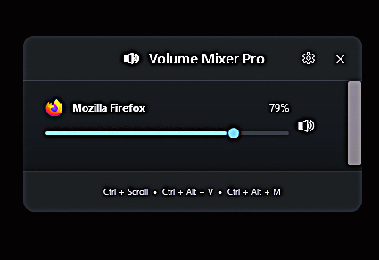
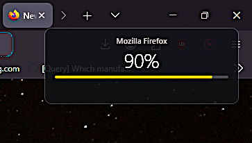
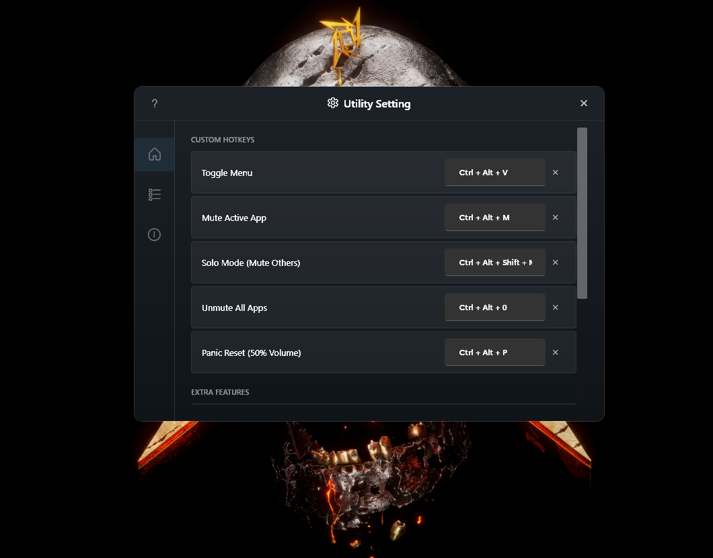

# Volume Mixer Pro (C# .NETx4.8)

A high-performance, native Windows audio utility designed to replace and exceed the functionality of the original AutoHotkey Volume Mixer. 

## Features
- **Silky Smooth UI:** High-FPS hardware-accelerated animations using WPF.
- **Advanced Overlay:** Real-time volume feedback with a custom ASCII gauge triggered by `Ctrl + Scroll`.
- **Zero-Lag Dragging:** Decoupled UI and Audio engines for instantaneous responsiveness.
- **Global Hotkeys:** 
  - `Ctrl + Alt + V`: Toggle Mixer Panel
  - `Ctrl + Scroll`: Adjust active app volume
  - `Ctrl + Alt + M`: Mute active app
  - `Ctrl + Alt + Shift + M`: Solo mode (Mute others)
  - `Ctrl + Alt + P / R`: Panic Reset (50% Volume)
- **Trackpad Integration:** Support for 4-finger gestures for advanced system-wide volume interaction.
- **Premium Win11 Architecture:** Modern tile-based settings layout with Segoe Fluent iconography and frosted glass (Mica) effects.
- **Custom Sliding Controls:** Native-feel sliding toggle switches, tactile bounce animations, and a spring-wobble help interface.

## Visuals

  
   
  <em>MainOverlay Interface with Native Win Design</em>

  
   
  <em>Real-time Volume Feedback Overlay</em>

  
   
  <em>Utility Setting Panel with Native Win Design</em>

## Technical Details
- **Framework:** .NET Framework 4.8
- **Language:** C#
- **Dependencies:** NAudio (for WASAPI/Core Audio interop)
- **Privileges:** Runs as Administrator to control system-wide audio sessions.

## Project Structure
- `VolumeService.cs`: Core logic for interacting with Windows Audio sessions.
- `HotkeyService.cs`: Low-level Win32 hooks for system-wide keyboard and mouse capture.
- `TrackpadService.cs`: Precision touchpad gesture tracking and event handling.
- `MainWindow.xaml`: The main glassmorphic mixer interface.
- `SettingsWindow.xaml`: Premium tile-based utility configuration panel.
- `OverlayWindow.xaml`: The transient real-time feedback overlay.
- `WindowHelper.cs`: DWM interop for modern Windows 11 styling.
